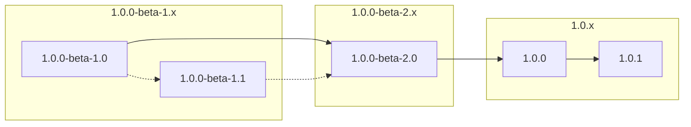

# Basic Introduction

A presentation slide made with [Slidev](https://sli.dev) about some characters in the Chinese novels [_Water Margin_](https://en.wikipedia.org/wiki/Water_Margin) _(also known as "_Shui Hu Zhuan_", "_Outlaws of the Marsh_" and "_All Men are Brothers_")_. 

# Sort of releases

